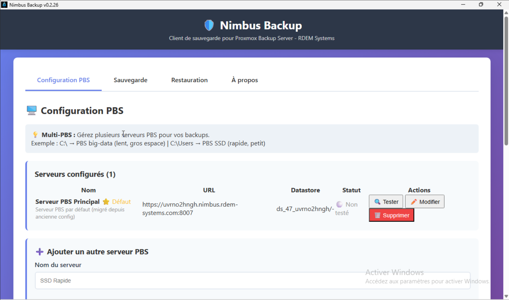
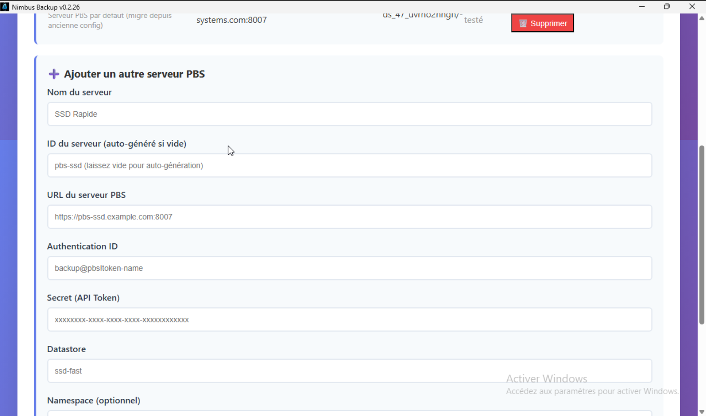
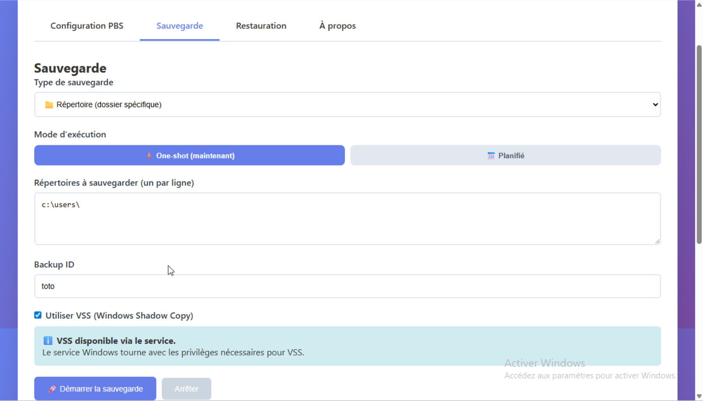

# Nimbus Backup - Proxmox Backup Server Client

Modern Windows backup client for Proxmox Backup Server with intuitive GUI interface.

## 🌐 RDEM Systems

- **Website**: https://www.rdem-systems.com/
- **Nimbus Backup - Fully managed PBS hosting**: https://nimbus.rdem-systems.com/
- **Support**: contact@rdem-systems.com

Don't want to self-host PBS? Use our managed service:
👉 [NimbusBackup - Managed PBS in France](https://nimbus.rdem-systems.com/?utm_source=github&utm_campaign=gui-client)

- ✅ From 12€/TB/month
- ✅ 1 TB free trial

## 📦 Download

👉 **[Download Latest Release](https://github.com/rdem-systems/proxmoxbackupclient_go/releases)**

## ✨ Features

### GUI Interface (Recommended)
- **🌍 Multi-language support** - French & English interface
- User-friendly configuration with connection testing
- Real-time backup progress with speed and ETA
- VSS (Volume Shadow Copy) support for consistent backups
- Multi-folder backup support
- Snapshot browsing and restore
- Automatic hostname detection
- Debug logging for troubleshooting

### 📸 Screenshots


*Multi-PBS server management with status indicators*


*Easy server configuration with connection testing*


*Real-time backup progress with ETA and speed*

### Security & Quality
- Input validation and credential sanitization
- Path traversal prevention
- Retry logic with exponential backoff
- Comprehensive error handling
- 100% lint compliance

### Smart System Exclusions (File Mode)
When backing up an entire drive (e.g., `D:\`), Nimbus Backup automatically excludes:

**System Folders:**
- `System Volume Information` - VSS snapshots storage (can be 100+ GB)
- `$RECYCLE.BIN` - Windows recycle bin
- `Recovery` - Windows recovery partition data

**System Files:**
- `pagefile.sys` - Windows page file
- `hiberfil.sys` - Hibernation file
- `swapfile.sys` - Windows swap file

**Why this matters:**
- Drive shows 1.03 TB used but actual files are 141 GB
- Without exclusions, backup would include VSS snapshots (wasted space + time)
- With exclusions, backup size matches real data (~141 GB)

**Recommendation:**
- **File-level backups** (default): Use file mode with auto-exclusions
- **Bare-metal restore**: Use disk mode in separate job (includes everything)

## 🚀 Quick Start

1. Download `NimbusBackup.exe` from releases
2. Run with administrator privileges (required for VSS)
3. Configure your PBS connection
4. Test connection
5. Select directories to backup
6. Start backup

## 📋 Requirements

- Windows 10/11 (64-bit)
- Administrator rights (for VSS snapshots)
- Network access to PBS server

## ⚠️ Disclaimer

This software is provided as-is. While we strive for reliability, we take no responsibility for any data loss or damage.
Always test your backups and verify restoration before relying on them in production.

## 🔮 Roadmap

### High Priority
- Client-side encryption with key management
- Code signing (Authenticode certificate)
- Auto-update system
- System tray icon and background service
- Scheduled backups (daily, weekly, custom)
- Windows service mode

### Future
- Bandwidth limiting
- Multi-core compression
- Windows toast notifications

## 🔨 Building from Source

### Prerequisites
- Go 1.22 or later
- Node.js 20 or later
- Wails CLI: `go install github.com/wailsapp/wails/v2/cmd/wails@latest`

### Build Commands
```bash
# Build GUI
cd gui
npm install --prefix frontend
wails build

# Run in dev mode (hot reload)
wails dev
```

## 📝 Source Project

This project is a fork of [tizbac/proxmoxbackupclient_go](https://github.com/tizbac/proxmoxbackupclient_go), enhanced with a modern GUI interface and additional features for Windows users.

**Original Project**: Proxmox Backup Client in Go
**Author**: Tiziano Bacocco (tizbac)
**License**: GPLv3

Key additions in this fork:
- Wails v2 GUI with React frontend
- Real-time progress tracking
- Enhanced error handling and logging
- Security hardening
- Comprehensive testing
- CI/CD pipelines

## 📄 License

GPLv3 - See LICENSE file

## 🤝 Contributing

Contributions are welcome! Priority areas:
1. 🔐 Client-side encryption
2. 🔄 Auto-update mechanism
3. 📅 Scheduled backups
4. 🔒 Code signing

---

**© 2024-2026 RDEM Systems. All rights reserved.**
